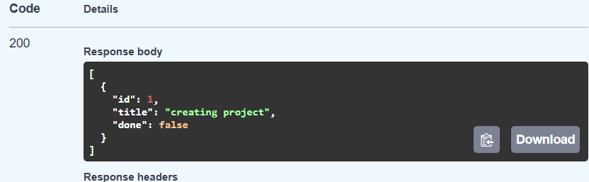
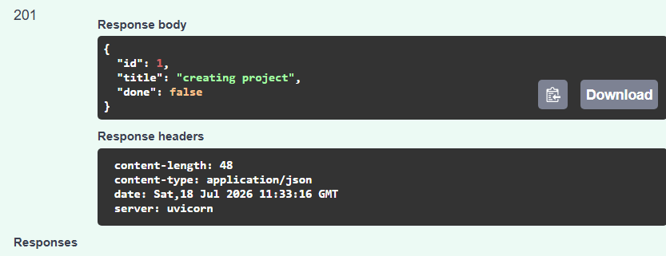
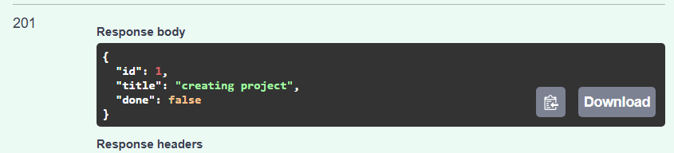
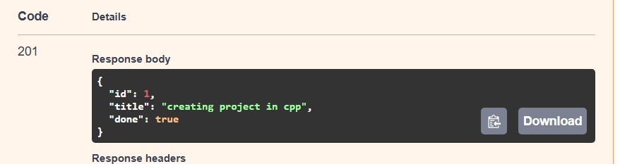
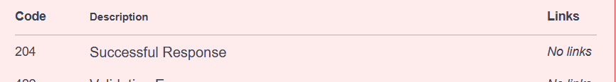

# Task Management API

A simple RESTful API built with **FastAPI** that provides CRUD (Create, Read, Update, Delete) functionality for managing a to-do list. This project demonstrates the fundamentals of backend API development, request handling, validation, and RESTful endpoint design.

> **Note:** This project stores data in memory. All tasks are lost when the server is restarted.

---

## Features

* Create new tasks
* Retrieve all tasks
* Retrieve a task by ID
* Update existing tasks
* Delete tasks
* Automatic interactive API documentation with Swagger UI
* Built using FastAPI

---

## Tech Stack

* Python
* FastAPI
* Uvicorn

---

## Getting Started

### 1. Clone the repository

```bash
git clone https://github.com/hasheem7203/backend-practice.git
cd backend-practice
```

### 2. Create and activate a virtual environment

**Windows**

```bash
python -m venv venv
venv\Scripts\activate
```

**Linux / macOS**

```bash
python -m venv venv
source venv/bin/activate
```

### 3. Install dependencies

```bash
pip install fastapi uvicorn
```

### 4. Run the application

```bash
uvicorn main:app --reload --port 8001
```

The API will be available at:

* API: `http://localhost:8001`
* Swagger UI: `http://localhost:8001/docs`

---

## API Endpoints

| Method | Endpoint      | Description               |
| ------ | ------------- | ------------------------- |
| GET    | `/tasks`      | Retrieve all tasks        |
| GET    | `/tasks/{id}` | Retrieve a task by its ID |
| POST   | `/tasks`      | Create a new task         |
| PUT    | `/tasks/{id}` | Update an existing task   |
| DELETE | `/tasks/{id}` | Delete a task             |

---

## Example Response

### Request

```http
GET /tasks/1
```

### Response (Task Not Found)

```json
{
"id":1,"title":"creating python project","done":false
}
```

---

## Swagger Documentation

FastAPI automatically generates interactive API documentation.

Visit:

```text
http://localhost:8001/docs
```







---

## Project Structure

```text
.
├── main.py
├── README.md
├── swagger-screenshot.png
└── venv/
```

---

## Future Improvements

* Store data in PostgreSQL
* SQLAlchemy ORM integration
* JWT Authentication
* User accounts
* Input validation enhancements
* Pagination and filtering
* Unit and integration testing

---

## License

This project was created for learning and backend development practice.
